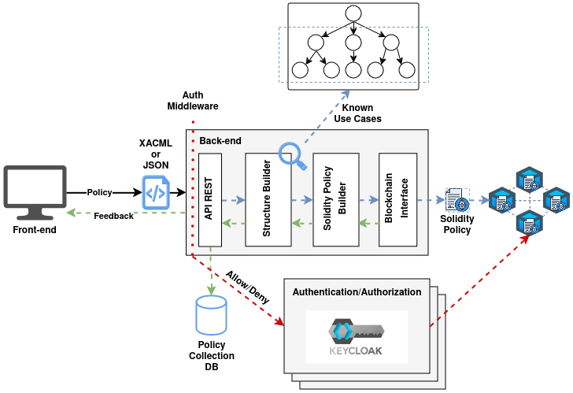

# ExtremeXP Policy Access Control


This project provides an interface for the ExtremeXP Access Control module,
enabling the translation of XACML policies into Solidity smart contracts.
The module's key responsibilities include:

- Acting as the backend for the ExtremeXP security layer.  
- Translating XACML policies into Solidity smart contracts.  
- Deploying the generated smart contracts onto the blockchain.  

> Note: The translator project is based on the [XACML](https://www.oasis-open.org/committees/xacml/) standard 
and the [Solidity](https://soliditylang.org/) programming language.

## Project Architecture




## Getting Started
```bash
# install the project development environment
make install
# run the project
make run
```
The server will be running on http://localhost:5521.
The Swagger documentation is available on the root page.


## Development Progress
#### Overall progress: 


#### Tasks:
- [x] Project Basic Structure (Flask API + Endpoints + kickoff script)
- [ ] XACML/JSON to the PolicyGraph structure (Structure Builder module)
- [ ] Map the XACML basic functions over the PolicyGraph (See: https://en.wikipedia.org/wiki/XACML#Functions)
- [ ] Translate the PolicyGraph to a Solidity Smart Contract (Solidity Policy Builder module)
- [x] Deploy the Smart Contract and retrieve the address (Blockchain Interface module)
- [x] Register the Policy address to some database (Policy Address DB)
- [x] Integrate with the Keycloak Authorization Server (OAuth or MetaMask)
- [x] Integrate with the [ExtremeXP Portal](https://github.com/ExtremeXP-VU/ExtremeXP-portal)
- [x] Add the Smart Contracts used for the ABAC module in the project for documentation purposes


### Tests:
Before running the tests, ensure your `.env` file is updated with all required environment variables.
It is essential that the blockchain network is up and running, and that your `.env` file contains the correct values
for the blockchain RPC address and the manager private key, specified as `BLOCKCHAIN_PRIVATE_KEY`.

```bash
# setup the test environment
make setup

# load local venv
source .venv/bin/activate

### UPDATE THE .env FILE WITH THE FOLLOWING VARIABLES ###

# create the account used for testing
python3 cli.py --cc 

# Copy the output private key and paste it in the .env file as TEST_USER_PRIVATE_KEY
TEST_USER_PRIVATE_KEY="your_private_key_here"

# deploy the smart contract used for testing
python3 cli.py -s

# Copy the output contract address and paste it in the .env file as the POLICY_* addresses
POLICY_INFORMATION_POINT_ADDRESS="pip_address_here"
POLICY_ADMINISTRATION_POINT_ADDRESS="pap_address_here"
POLICY_DECISION_POINT_ADDRESS="pdp_address_here"

# deploy the policy smart contract used for testing
python3 cli.py -d SamplePolicy.sol --deploy-args-file SamplePolicy.json
# Copy the output contract address and paste it in the .env file as SAMPLE_POLICY_ADDRESS
SAMPLE_POLICY_ADDRESS="sample_policy_address_here"

# run the tests
python3 cli.py -t
```

## Usage
For a full documentation of the API endpoints, please refer to the pages available at 
How to: https://yagorezende.github.io/extremexp_accesscontrol
Swagger UI: https://yagorezende.github.io/extremexp_accesscontrol/swagger