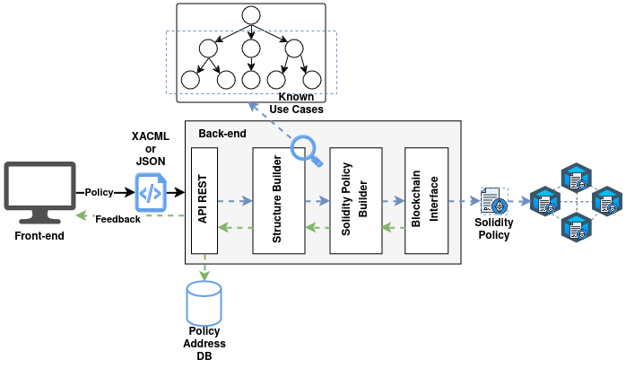

# ExtremeXP Access Control API Documentation

## Overview
ExtremeXP Access Control is a modular system designed for managing access policies, user authentication, and resource authorisation through blockchain and Keycloak integration. It offers RESTful endpoints for policy evaluation, resource management, and organisational access control.

## How The ExtremeXP Access Control Works
The ExtremeXP Access Control (AC) system is modular, consisting of independent components that enforce access control using distributed ledger technology (DLT). The image below illustrates the interaction between these modules.


The red box represents the AC Proxy, which intercepts requests for the protected modules. The blue box represents the AC Interface, which simplifies the management of user attributes on the blockchain (the distributed ledger technology applied) and the user authentication on Keycloak. The AC Interface provides its services to connected applications via a REST API. Through this API, applications can manage user profiles and attributes, handle resources and policies, and validate access permissions for specific resources. To achieve this integration, the project deploys both the AC Interface and the AC Proxy using Docker Images available in the GitHub packages repository.

The architectural image illustrates a reference model for access control deployment, delivering each service using Docker Compose for container management, with Nginx serving as a reverse proxy and a single entry point for all web services.

> * AC Poxy Docker Images: https://github.com/yagorezende/extremexp-abacproxy/pkgs/container/extremexp-abacproxy
> * AC Interface Docker Images: https://github.com/yagorezende/extremexp_accesscontrol/pkgs/container/extremexp_accesscontrol

---

### How Policy Enforcement Works
When a user requests access to a protected resource, the AC Proxy intercepts the request and forwards it to the AC Interface for evaluation. The AC Interface retrieves some user attributes from Keycloak and sends them to the blockchain for assessment. It then determines whether the user has the necessary permissions to access the resource based on predefined policies. If access is granted, the AC Interface sends a positive response back to the AC Proxy, which allows the request to proceed to the protected resource. If access is denied, the AC Proxy responds with an appropriate error message.

> It's important to note that, from the user's perspective, this entire process is seamless. If the user has the correct access permissions, the AC Proxy forwards the request and delivers the response as expected. If the user does not have the appropriate permissions, the AC Proxy will return an error message. Additionally, the entire process creates a record in the blockchain for traceability purposes.

To ensure effective policy enforcement, the following conditions must be met:
1. The user must have a registered blockchain account.
2. The organisation providing the services must also have a blockchain account. The AC Interface will use this account to interact with the blockchain's smart contracts.
3. A policy must be deployed on the blockchain as a smart contract, which includes all the required values from the user context attributes.
4. The resource that needs protection must be registered on the blockchain, along with the address of the policy that safeguards it.
5. User attributes, such as groups and roles within the organisation, must be stored on the blockchain.
6. The user must commit the OnBehalfOf transaction to allow the organisation to act on their behalf for the next 24 hours.

> To meet all these points, the application can use the REST API example below.

## REST API Endpoints
### User Management
`POST /extreme_auth/api/v1/person/login`: Authenticate.

Body
```JSON
{
  "username": "user1",
  "password": "password123"
}
```
Response - 200 OK
```JSON
{
  "access_token": "eyJ...",
  "expires_in": 36000,
  "refresh_expires_in": 36000,
  "refresh_token": "eyJ...",
  "token_type": "Bearer",
  "id_token": "eyJ...",
  "not-before-policy": 0,
  "session_state": "0a1b2c3d-4e5f-6a7b-8c9d-a0b1c2d3e4f5",
  "scope": "openid email profile"
}
```
---
`POST /extreme_auth/api/v1/person/register`: Register a new user.

Body
```JSON
{
  "username": "user1",
  "password": "password123",
  "email": "johndoe@extreme.xp",
  "name": "John Doe"
}
```
Response - 201 Created
```JSON
{
	"id": "0a1b2c3d-4e5f-6a7b-8c9d-a0b1c2d3e4f5",
	"createdTimestamp": 1761102304466,
	"username": "user1",
	"enabled": true,
	"totp": false,
	"emailVerified": true,
	"firstName": "John",
	"lastName": "Doe",
	"email": "johndoe@extreme.xp",
	"attributes": {
		"userWalletAddress": [
			"N/A"
		],
		"userLocationLat": [
			"0.0"
		],
		"userPublicKey": [
			"N/A"
		],
		"locale": [
			"en"
		],
		"userLocationLong": [
			"0.0"
		]
	},
	"disableableCredentialTypes": [],
	"requiredActions": [],
	"notBefore": 0,
	"access": {
		"manageGroupMembership": true,
		"view": true,
		"mapRoles": true,
		"impersonate": true,
		"manage": true
	}
}
```
---
> ⚠️ The user Bearer token must be included in the Authorization header for this request.

`POST /extreme_auth/api/v1/person/user/{user_uuid}`: Update user attributes.

> ⚠️ Unfortunately, Keycloak's API does not support partial updates for user attributes. Therefore, when updating user attributes, you must provide the complete set of attributes you wish to retain, along with any new attributes you want to add or modify. Failing to include existing attributes in the update request will result in their removal from the user's profile.

Body
```JSON
{
	"groups": ["admin", "analyst"],
	"role": "admin",
	"attributes": {
		"userPublicKey": "0x51a76311f22720ba2233ecbd03e3b2be70a7cf084cb3dec4e6f6882a8b37aeeacb46a457fe800daed7642bdd3188f6ba1df887a1911406d0a31e7d3efe46493d",
		"userWalletAddress": "0x109f874697290f7C17a7a8A83C918226377aCC08",
		"userLocationLat": 51999279,
		"userLocationLong": 4377257
	}
}
```

> ❗ Some of the attributes are kept in the blockchain for access control purposes. For this reason, the endpoint will also create multiple transactions on the blockchain to update those attributes.

Response - 200 OK
```JSON
{
    "groups": [
        "admin",
        "analyst"
    ],
    "role": "admin",
    "attributes": {
        "userPublicKey": "0x51a76311f22720ba2233ecbd03e3b2be70a7cf084cb3dec4e6f6882a8b37aeeacb46a457fe800daed7642bdd3188f6ba1df887a1911406d0a31e7d3efe46493d",
        "userWalletAddress": "0x109f874697290f7C17a7a8A83C918226377aCC08",
        "userLocationLat": 51999279,
        "userLocationLong": 4377257,
        "name": "John Doe",
        "email": "johndoe@extreme.xp",
        "given_name": "John",
        "family_name": "Doe"
    },
    "transactions": [
    {
        "group": "admin",
        "transaction": {
            "blockHash": "f1171de59cf7dab68e6b6039443ecce9294df67d6963d918069e7462785eb264",
            "blockNumber": 17623,
            // ...
        }
    },
    {
        "group": "analyst",
        "transaction": {
            "blockHash": "b8ea7cb009235aac19d4070320e731e3d2958c11f89f0dd88b889fe35dce7723",
            "blockNumber": 17624,
            // ...
    }
    },
    {
        "role": "admin",
        "transaction": {
            "blockHash": "024fc468333881f9cf0ceda3e4f339f0e62b7e5bd6d9290cec1edc79aca518ba",
            "blockNumber": 17625,
            // ...
        }
    }]
}
```
---
### Resource Management
> ⚠️ The user Bearer token must be included in the Authorization header for this request.

`POST /extreme_auth/api/v1/resource/protect`: Register a new resource to protect.

> Fields description:
> * `uri`: The unique identifier of the resource to be protected.
> * `content_hash`: The hash of the resource content used to ensure integrity.
> * `policy_address`: The blockchain address of the policy smart contract that governs access to this resource.

> Response description:
> * `PIP_transaction`: The blockchain transaction details for registering the resource in the Policy Information Point (PIP).
> * `PAP_transaction`: The blockchain transaction details for associating the resource with the policy in the Policy Administration Point (PAP).

Body
```JSON
{
  "uri": "/resource_1",
  "content_hash": "0xdd53b8d39f0081a9960cebe2aea4fcdcf3ff266ef1b6339a2d966b80096e337e",
  "policy_address": "0x2f784e0466a1498def442a89fc8789ef6d8973cd"
}
```

Response - 201 Created
```JSON
{
    "PIP_transaction": {
        "blockHash": "bf989eaf230b35e6119431fa7629e1cad2c44a568dc4aab4d2c63e54228f4ad5",
        "blockNumber": 31516,
        // ...
    },
    "PAP_transaction": {
        "blockHash": "a66a2f6a8b609c38ddad21e9ab7a224d50318e23833ae11240801213b82e2c03",
        "blockNumber": 31517,
        // ...
    }
}
```
---
> ⚠️ The user Bearer token must be included in the Authorization header for this request. 

`POST /extreme_auth/api/v1/resource/access`: Evaluate access to a protected resource.

> Fields description:
> * `uri`: The unique identifier of the resource being accessed.
> * `origin_ip`: The IP address from which the access request originates.
> * `scope`: The scope of access being requested for the resource.

>  Response description:
> * `grant`: A boolean indicating whether access to the resource is granted
> if the access is denied, the response will be a 403 Forbidden error.

Body
```JSON
{
  "uri": "/resource_1",
  "origin_ip": "172.21.0.1",
  "scope": "read:data"
}
```

Response - 200 OK | 403 Forbidden
```JSON
{
    "grant": true
}
```

> 🌟 For a more comprehensive list of API endpoints and their documentation, please refer to the [ExtremeXP Access Control API Swagger](https://yagorezende.github.io/extremexp_accesscontrol/swagger/).

---
## ABAC Smart Contracts Deep Dive

> ❗ Soon, more documentation about the smart contracts used for the ABAC module will be added here.


---
## OnBehalfOf Transaction

> ❗ Soon, more documentation about the OnBehalfOf transaction will be added here.


---
## AC Policy Translator

> ❗ Soon, more documentation about the AC Policy Translator will be added here.

